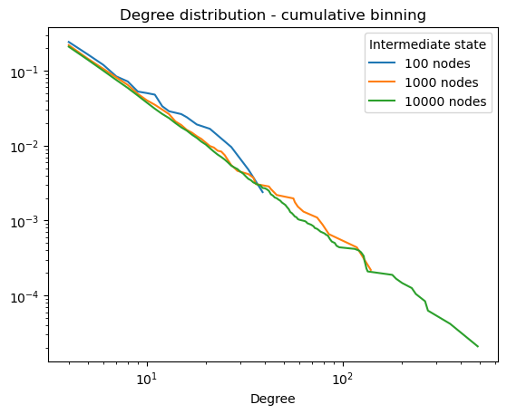

### Implementation of the [barabasi-albert model](https://en.wikipedia.org/wiki/Barabási–Albert_model. "ba model on Wikipedia")

This model is based on two fundamental concepts : growth and preferential attachment.
Generated networks are scale free, and their degree distribution follows a power law. (cf image below)

