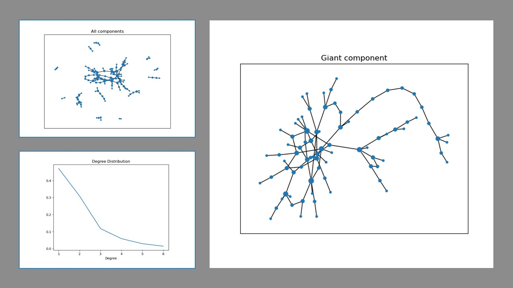

# Motivation

This small package is an implementation of the [configuration model](https://en.wikipedia.org/wiki/Configuration_model#:~:text=In%20network%20science%2C%20the%20configuration,to%20incorporate%20arbitrary%20degree%20distributions. "Configuration model on Wikipedia") to generate networks whose degree distribution follows a power law. Such networks are scale free and they exhibit a small number of hubs with relatively high degree.

# Example

